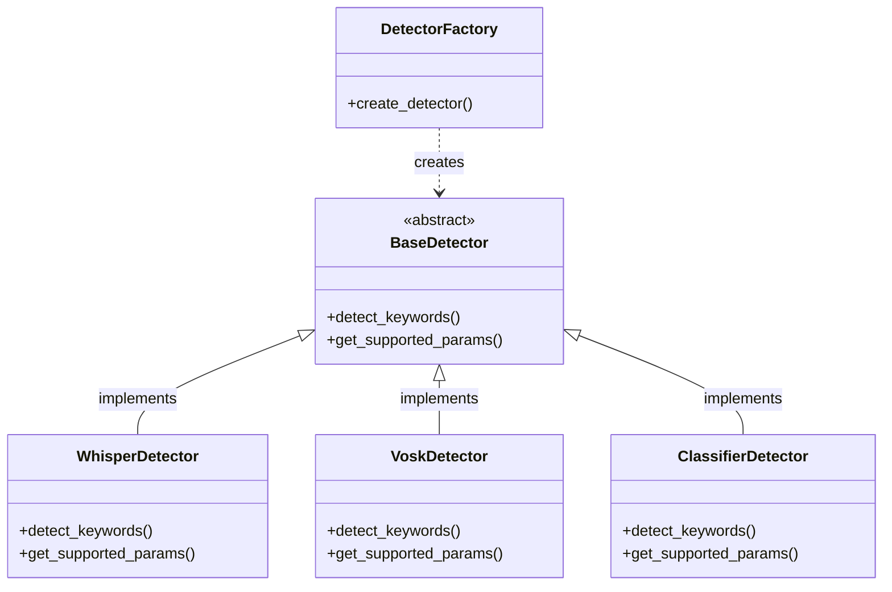

# Audio Keyword Detection System

A powerful, flexible system for detecting keywords in audio recordings using multiple detection strategies. This system can identify specific keywords in audio files, providing information about occurrences, positions, and confidence levels.

## Features

- **Unified Strategy Pattern Architecture**: 
  - **Whisper-based detection**: Utilizes OpenAI's Whisper model for speech-to-text transcription
  - **ML Classifier-based detection**: Direct audio fingerprinting for keyword identification
  - **Extensible framework**: Easily add new detection strategies with the strategy pattern
  
- **Unified API**: Single interface for all detection methods

- **Flexible Deployment**: Run as a standalone CLI tool or as a REST API service

- **Distributed Architecture**: Queue-based result distribution using MQTT or Redis

- **Detailed Analytics**: Information about keyword occurrences, positions, and confidence levels

- **Custom Metadata Support**: Pass timestamps, framerates, output paths, and other custom metadata through the system

- **Built for Scale**: Docker ready with optimized resource usage

## Table of Contents

- [Installation](#installation)
- [Quick Start](#quick-start)
- [Usage](#usage)
  - [Training Models](#training-models)
  - [Command Line Interface](#command-line-interface)
  - [API Usage](#api-usage)
  - [Docker Deployment](#docker-deployment)
- [Architecture](#architecture)
- [Reference](#reference)
- [Contributing](#contributing)
- [License](#license)

## Installation

### Prerequisites

- Python 3.9 or later
- FFmpeg (for audio processing)
- Redis (optional, for Redis queue strategy)
- MQTT broker (optional, for MQTT queue strategy)

### Setup

1. **Clone the repository**

```bash
git clone https://github.com/yourusername/audio-detection-system.git
cd audio-detection-system
```

2. **Create and activate a virtual environment**

```bash
python -m venv .venv
source .venv/bin/activate  # On Windows, use: .venv\Scripts\activate
```

3. **Install dependencies**

```bash
pip install -r requirements.txt
```

## Quick Start

Here's how to quickly get started with the audio keyword detection system:

### Train a Model

```bash
# Train a classifier model using a directory of audio samples
python -m cli.train training_data --model models/keyword_model.pkl
```

### Detect Keywords

```bash
# Using classifier strategy
python -m cli.detect path/to/audio.wav --keywords "hello,world" --strategy classifier --model models/keyword_model.pkl --threshold 0.6

# Using Whisper strategy
python -m cli.detect path/to/audio.wav --keywords "hello,world" --strategy whisper --threshold 0.5
```

### Start the API Server

```bash
uvicorn api.app:app --host 0.0.0.0 --port 8000
```

### Use the API

```bash
curl -X POST http://localhost:8000/keywords/detect \
  -F "file=@path/to/audio.wav" \
  -F "strategy=whisper" \
  -F "keywords=hello,world" \
  -F "threshold=0.5"
```

## Usage

### Training Models

The system can be trained to recognize specific keywords using a directory structure where each subdirectory represents a keyword class:

```
training_data/
├── keyword1/
│   ├── sample1.wav
│   ├── sample2.wav
│   └── ...
├── keyword2/
│   ├── sample1.wav
│   ├── sample2.wav
│   └── ...
└── negative/
    ├── sample1.wav
    ├── sample2.wav
    └── ...
```

Train a model with:

```bash
python -m cli.train training_data --model models/my_model.pkl
```

This extracts features from audio samples and trains a random forest classifier.

### Command Line Interface

#### Detect Keywords in Audio Files

```bash
# Basic usage
python -m cli.detect audio_file.wav --keywords "word1,word2" --strategy whisper --threshold 0.5

# With classifier strategy and a trained model
python -m cli.detect audio_file.wav --keywords "word1,word2" --strategy classifier --model models/my_model.pkl --threshold 0.6

# Adjust confidence threshold
python -m cli.detect audio_file.wav --keywords "word1,word2" --threshold 0.7
```

#### Client Tool for API Interaction

```bash
# Check API health
python -m cli.client health

# List available detection strategies
python -m cli.client strategies

# Detect keywords using the API
python -m cli.client detect audio_file.wav "word1,word2" --strategy whisper --threshold 0.5

# Subscribe to detection results
python -m cli.client subscribe keyword_detections

# Specify queue type for subscription
python -m cli.client subscribe keyword_detections --queue-type mqtt
```

### API Usage

#### Start the API Server

```bash
uvicorn api.app:app --host 0.0.0.0 --port 8000
```

#### API Endpoints

- `GET /health`: Health check endpoint
- `GET /keywords/strategies`: List available detection strategies
- `POST /keywords/detect`: Detect keywords in an audio file

#### Example API Request

```bash
# Basic detection request
curl -X POST http://localhost:8000/keywords/detect \
  -F "file=@audio_file.wav" \
  -F "strategy=whisper" \
  -F "keywords=word1,word2" \
  -F "threshold=0.6" \
  -F "topic=my_custom_topic"

# VOSK detection for Arabic
curl -X POST http://localhost:8000/keywords/detect \
  -F "file=@arabic_file.wav" \
  -F "strategy=vosk" \
  -F "keywords=جهاد,كفار" \
  -F "model=vosk-model-ar-0.22" \
  -F "threshold=0.5" \
  -F "topic=arabic_detections"

# With metadata
curl -X POST http://localhost:8000/keywords/detect \
  -F "file=@audio_file.wav" \
  -F "strategy=whisper" \
  -F "keywords=word1,word2" \
  -F "threshold=0.6" \
  -F "topic=my_custom_topic" \
  -F 'metadata={"timestamp":"2025-03-21T12:00:00Z","framerate":30,"source":"camera1","output_path":"/storage/results/"}'
```

#### Example API Response

```json
{
  "success": true,
  "job_id": "550e8400-e29b-41d4-a716-446655440000",
  "strategy": "whisper",
  "transcription": "This is an example transcription with word1 and word2 in it.",
  "detections": [
    {
      "keyword": "word1",
      "detected": true,
      "occurrences": 1,
      "positions": [27],
      "confidence_scores": [0.95]
    },
    {
      "keyword": "word2",
      "detected": true,
      "occurrences": 1, 
      "positions": [37],
      "confidence_scores": [0.92]
    }
  ],
  "duration_seconds": 3.45,
  "processing_time_seconds": 1.23,
  "metadata": {
    "timestamp": "2025-03-21T12:00:00Z",
    "framerate": 30,
    "source": "camera1",
    "output_path": "/storage/results/"
  }
}
```

#### Testing the Metadata Feature

You can test the metadata feature with the following command:

```bash
# Using curl
curl -X POST http://localhost:8000/keywords/detect \
  -F "file=@audio_file.wav" \
  -F "strategy=whisper" \
  -F "keywords=hello,world" \
  -F "threshold=0.5" \
  -F 'metadata={"timestamp":"2025-03-21T12:00:00Z","framerate":30,"custom_field":"any value"}'

# Using Python requests
python -c "
import requests
import json

url = 'http://localhost:8000/keywords/detect'
files = {'file': open('audio_file.wav', 'rb')}
metadata = {
    'timestamp': '2025-03-21T12:00:00Z',
    'framerate': 30,
    'source': 'camera1',
    'output_path': '/storage/results/'
}

data = {
    'strategy': 'whisper',
    'keywords': 'hello,world',
    'threshold': '0.5',
    'metadata': json.dumps(metadata)
}

response = requests.post(url, files=files, data=data)
print(json.dumps(response.json(), indent=2))
"
```

### Docker Deployment

The system is Docker-ready and can be deployed using Docker Compose:

```bash
# Start all services using the provided script
./scripts/run.sh

# Other useful commands
./scripts/run.sh up -d    # Start services in detached mode
./scripts/run.sh down     # Stop services
./scripts/run.sh logs -f  # Follow logs
```

The Docker setup includes:
- The Audio Detection API service
- Redis for queue management (optional)
- Mosquitto MQTT broker for message distribution (optional)

## Architecture

The system is built using the strategy pattern to provide a unified interface for different detection approaches:



The strategy pattern allows for different detection implementations while maintaining a consistent interface, making it easy to:

1. Add new detection strategies in the future
2. Switch between strategies based on requirements
3. Present a unified API to users regardless of the underlying implementation

### Queue Integration

Both detection strategies send results to a message queue using a configurable queue management system:


### Directory Structure

```
audio-detection-system/
├── api/                  # FastAPI application & endpoints
├── core/                 # Core detection logic
│   └── detection/        # Strategy pattern implementations 
├── queueing/             # Queue management system
├── cli/                  # Command-line interface tools
├── models/               # Trained model storage
├── config/               # Configuration management
├── docker/               # Docker configuration files
├── tests/                # Unit and integration tests
├── scripts/              # Utility scripts
└── requirements.txt      # Project dependencies
```

## Reference

### Detection Strategies

#### VOSK Strategy

Uses the VOSK offline speech recognition toolkit for transcription and keyword detection. Advantages:
- Works completely offline (no internet required)
- Supports Arabic and multiple other languages
- Faster than Whisper for short utterances
- Lower memory requirements
- Suitable for embedded systems and edge devices

Implementation is provided in `core/detection/vosk_detector.py`.

Available models:
- `vosk-model-ar-0.22` (Arabic)
- `vosk-model-small-en-us-0.22` (English)

#### Whisper Strategy

Uses OpenAI's Whisper model to transcribe audio and then perform text search for keywords. Advantages:
- High accuracy for transcription
- Can detect keywords in context
- Works with any vocabulary

Implementation is provided in `core/detection/whisper.py`.

#### Classifier Strategy

Uses a trained machine learning model to detect keywords directly from audio features. Advantages:
- Faster processing
- Works offline
- Better for short, specific keywords
- Lower resource usage

Implementation is provided in `core/detection/classifier.py`.

### Adding New Strategies

To add a new detection strategy:
1. Create a new class that extends `BaseDetector` (in `core/detection/base.py`)
2. Implement the required methods: `detect_keywords()` and `get_supported_params()`
3. Add the new strategy to the `DetectorFactory` in `core/detector_factory.py`

### Queue Strategies

The system supports multiple message queue strategies:

- **MQTT**: Lightweight messaging protocol, good for IoT applications
- **Redis**: In-memory data structure store, useful for high-throughput scenarios
- **Logging**: Fallback strategy that logs messages without external dependencies

### Metadata Support

The system supports passing arbitrary metadata along with detection requests. This metadata flows through the API and is included in both API responses and queue messages. Metadata can be used for:

- Tracking source information (timestamps, recording device, etc.)
- Specifying output preferences (file paths, formats)
- Adding custom application-specific data
- Linking related requests or processing steps

Metadata is passed as a JSON string in API requests and is available as a JSON object in responses.

### Configuration Options

Configuration can be set using environment variables:

| Variable | Description | Default |
|----------|-------------|---------|
| `API_HOST` | API host | 0.0.0.0 |
| `API_PORT` | API port | 8000 |
| `WHISPER_MODEL` | Whisper model size | base |
| `VOSK_MODEL_PATH` | Path to VOSK model directory | models/vosk-model-ar-0.22 |
| `VOSK_SAMPLE_RATE` | Audio sample rate for VOSK | 16000 |
| `DEFAULT_MODEL_DIR` | Classifier models directory | models |
| `DEFAULT_THRESHOLD` | Default detection threshold | 0.5 |
| `QUEUE_TYPE` | Queue strategy (mqtt, redis, logging) | mqtt |
| `MQTT_BROKER_URL` | MQTT broker URL | localhost |
| `MQTT_PORT` | MQTT broker port | 1883 |
| `REDIS_URL` | Redis URL | redis://redis:6379/0 |

**Important note on threshold values:**
- Always set a detection confidence threshold appropriate for your use case
- For Whisper strategy: values closer to 0.5 are often sufficient (default)
- For VOSK strategy: the threshold has less impact as it uses exact text matching
- For Classifier strategy: higher values (0.6-0.8) may be needed for better precision
- Lower thresholds increase recall but may produce more false positives
- Higher thresholds increase precision but may miss some occurrences
- Test and tune the threshold for your specific audio and keywords

See `config/settings.py` for a complete list of options.

## Contributing

Contributions are welcome! Please feel free to submit a Pull Request.

1. Fork the repository
2. Create your feature branch (`git checkout -b feature/amazing-feature`)
3. Commit your changes (`git commit -m 'Add some amazing feature'`)
4. Push to the branch (`git push origin feature/amazing-feature`)
5. Open a Pull Request

## License

This project is licensed under the MIT License - see the LICENSE file for details.